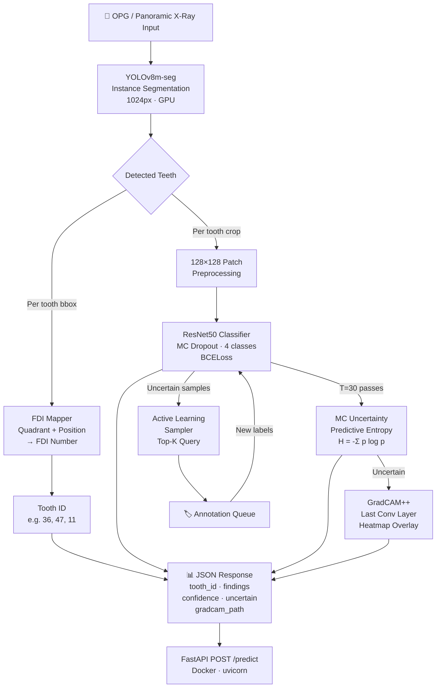

# OralGuard — Uncertainty-Aware Multi-Task Dental Pathology Detection

<div align="center">


**Automated detection and localization of dental pathologies from panoramic radiographs (OPG)**  
**with FDI tooth numbering, Monte Carlo uncertainty estimation, and GradCAM++ explainability.**

</div>

---

## Architecture



---

## Datasets

| Dataset | Source | Size | Task |
|---------|--------|------|------|
| **DENTEX 2023** | MICCAI 2023 Challenge | ~2.4GB | Detection + Enumeration |
| Teeth Segmentation | Kaggle (humansintheloop) | ~500MB | Segmentation masks |
| Dental Cavity Detection | Kaggle (maazmakhdoom) | ~300MB | Caries detection |
| Adult Caries Dataset | Kaggle (mariamosamakhalifa) | ~200MB | Adult caries |
| Children's Panoramic | Kaggle (truthisneverlinear) | ~1.2GB | Pediatric radiographs |

**Citation — DENTEX 2023:**
```
Hamamci et al. (2023). DENTEX: An Abnormal Tooth Detection with Dental Enumeration
and Diagnosis Benchmark for Panoramic X-Rays. MICCAI 2023 Challenge.
https://arxiv.org/abs/2305.11106
```

---

## Tech Stack

| Layer | Technology | Version |
|-------|-----------|---------|
| **Detection** | YOLOv8m-seg (Ultralytics) | 8.4.62 |
| **Classification** | ResNet50 (PyTorch) | 2.12.0 |
| **Uncertainty** | Monte Carlo Dropout | — |
| **Explainability** | GradCAM++ (pytorch-grad-cam) | 1.5.5 |
| **Active Learning** | Entropy-based pool sampling | — |
| **Experiment Tracking** | MLflow | 3.13.0 |
| **API** | FastAPI + Uvicorn | 0.136.3 |
| **Containerisation** | Docker | — |
| **GPU** | CUDA 12.8 (RTX 4060 Laptop) | cu128 |
| **CI/CD** | GitHub Actions | — |

---

## Project Structure

```
oralguard/
├── data/
│   ├── dentex/            # DENTEX 2023 (MICCAI)
│   ├── segmentation/      # Teeth segmentation
│   ├── cavity/            # Cavity detection
│   ├── adult_caries/      # Adult caries
│   └── pediatric/         # Children's panoramic
├── src/
│   ├── detector/
│   │   ├── yolo_trainer.py    # YOLOv8 training
│   │   ├── dental.yaml        # YOLO dataset config
│   │   ├── fdi_mapper.py      # FDI tooth numbering
│   │   └── weights/           # Trained YOLO weights
│   ├── classifier/
│   │   ├── model.py           # ResNet50 multi-label
│   │   ├── train.py           # Training loop + MLflow
│   │   ├── uncertainty.py     # MC Dropout inference
│   │   └── checkpoints/       # Saved checkpoints
│   ├── active_learning/
│   │   └── sampler.py         # Entropy-based query
│   └── explainability/
│       └── gradcam.py         # GradCAM++ heatmaps
├── api/
│   ├── main.py                # FastAPI server
│   └── Dockerfile
├── tests/
│   └── test_fdi_mapper.py
├── notebooks/
├── mlflow/
├── outputs/
│   └── gradcam/
├── .github/workflows/ci.yml
├── requirements.txt
└── README.md
```

---

## How to Run

### 1. Setup

```powershell
# Clone the repo
git clone https://github.com/drenosh/oralguard.git
cd oralguard

# Create virtual environment
python -m venv .venv
.venv\Scripts\activate   # Windows
# source .venv/bin/activate  # Linux/Mac

# Install dependencies (CUDA 12.8)
pip install torch torchvision torchaudio --extra-index-url https://download.pytorch.org/whl/cu128
pip install -r requirements.txt
```

### 2. Download Datasets

```powershell
# Configure Kaggle credentials
# Place kaggle.json in C:\Users\<user>\.kaggle\

kaggle datasets download -d truthisneverlinear/dentex-challenge-2023 -p data/dentex/
Expand-Archive -Path data\dentex\*.zip -DestinationPath data\dentex\ -Force
# (repeat for other datasets)
```

### 3. Train Detector

```powershell
python -m src.detector.yolo_trainer
```

### 4. Train Classifier

```powershell
python -m src.classifier.train --csv data/patches/labels.csv --epochs 100
```

### 5. Run API

```powershell
uvicorn api.main:app --host 0.0.0.0 --port 8000 --reload
# Swagger UI: http://localhost:8000/docs
```

### 6. Docker

```bash
docker build -f api/Dockerfile -t oralguard:latest .
docker run --gpus all -p 8000:8000 oralguard:latest
```

### 7. Run Tests

```powershell
pytest tests/ -v
```

---

## API Usage

```python
import requests

with open("panoramic_xray.jpg", "rb") as f:
    response = requests.post(
        "http://localhost:8000/predict",
        files={"file": ("xray.jpg", f, "image/jpeg")}
    )

result = response.json()
for tooth in result["findings"]:
    print(f"Tooth {tooth['tooth_id']} ({tooth['tooth_label']})")
    print(f"  Findings   : {tooth['findings']}")
    print(f"  Confidence : {tooth['confidence']}")
    print(f"  Uncertain  : {tooth['uncertain']}")
    print(f"  GradCAM    : {tooth['gradcam_path']}")
```

**Sample Response:**
```json
{
  "request_id": "a1b2c3d4",
  "image_filename": "panoramic.jpg",
  "num_teeth_detected": 28,
  "processing_time_ms": 1243.7,
  "findings": [
    {
      "tooth_id": 36,
      "tooth_label": "LL 1st Molar",
      "findings": ["caries", "deep_caries"],
      "confidence": {
        "caries": 0.8712,
        "deep_caries": 0.6534,
        "periapical_lesion": 0.1203,
        "impacted_tooth": 0.0432
      },
      "uncertain": false,
      "gradcam_path": "outputs/gradcam/a1b2c3d4_tooth3_fdi36_caries.png"
    }
  ]
}
```

---

## Results

> 🚧 **Placeholder — to be updated after training completes**

| Metric | Detector (YOLO) | Classifier (ResNet50) |
|--------|----------------|-----------------------|
| mAP@50 | — | — |
| mAP@50-95 | — | — |
| Val F1 (macro) | — | — |
| Uncertainty calibration (ECE) | — | — |
| Inference time (RTX 4060) | — | — |

---

## Uncertainty Estimation

OralGuard uses **Monte Carlo Dropout** (Gal & Ghahramani, 2016) for epistemic uncertainty estimation:

1. Dropout (`p=0.4`) is placed **inside** `forward()` — active even in `eval()` mode
2. `T=30` stochastic forward passes are run per tooth patch
3. **Predictive entropy** is computed: `H = -Σ p·log(p + ε)`
4. Teeth with `H > 0.5` are flagged as uncertain
5. Uncertain cases are queued for expert review via the **active learning sampler**

---

## Active Learning Loop

```
Unlabeled Pool → MC Uncertainty → Top-K Selection → Expert Annotation → Retraining
      ↑                                                                       |
      └───────────────────────────────────────────────────────────────────────┘
```

Default: `K=50` images per active learning cycle, selected by highest entropy.

---

## Author

**Dr. Enosh A. Paulson, BDS (RGUHS)**  
PGDMI Candidate, IIHMR Bangalore  

*Building AI-assisted dental diagnostics at the intersection of clinical practice and machine intelligence.*

---

## License

MIT License — see [LICENSE](LICENSE) for details.

---

## References

1. Hamamci et al. (2023). *DENTEX Challenge 2023*. MICCAI.
2. Gal & Ghahramani (2016). *Dropout as a Bayesian Approximation*. ICML.
3. Selvaraju et al. (2020). *Grad-CAM: Visual Explanations from Deep Networks*. IJCV.
4. Jocher et al. (2023). *Ultralytics YOLOv8*. Zenodo.
